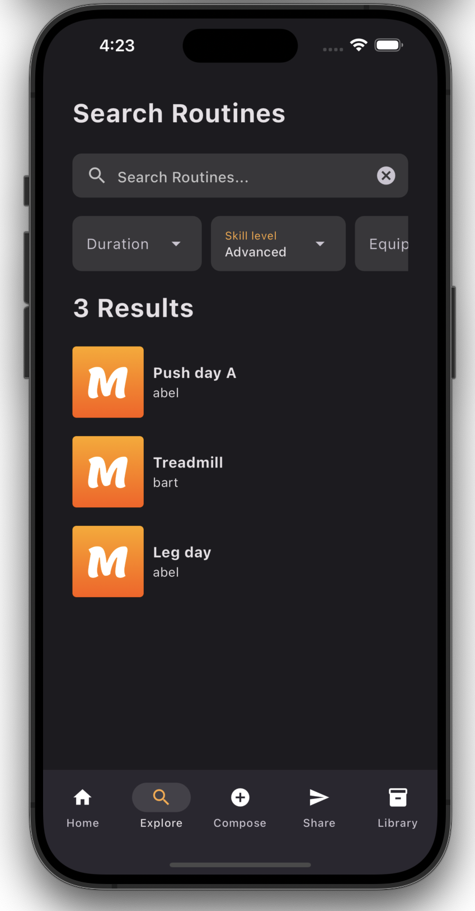

# Muve

## About Muve
Muve is an mobile application built for **composing** exercise routines, **sharing** those routines with your network, and **exploring** routines of other Muve users.

Version 0.2 supports the **core tasks**:
1. Logging in
2. Creating a new user
2. Viewing a homepage of recent routines
3. Viewing a detailed view of a routine
4. Viewing a library of all a user’s routines

Version 0.2 also supports the **key tasks**:
1. Composing a new routine. This includes adding any number of exercises to a routine. Filling out those exercises with multiple sets and adding songs to the routine. Up to three tags can also be added to a routine.
2. Exploring routines. Users can search by routine name or one of the tags.
3. Sharing routines. Users can share a link to a routine either by SMS or by copying the link to the clipboard.

## Setting up

Muve is written in the Dart/Flutter framework. It's been developed and tested using VS Code on MacOS running in the iOS *(iPhone 15 Pro Max)* simulator.

Muve uses Firebase/Firestore for cloud storage and retrieval of routines. The Firebase module is integrated into Muve with Cocoapods. 

To install the dependencies used for Firebase in this application, do the following

```bash
# If using an iOS simulator
cd muve_application/ios
pod install

```
(If a repository out-of-date error occurs), do the following
```bash
cd muve_application/ios

# Remove outdated dependencies 
rm Podfile.lock
pod repo remove trunk

# Install updated repository
pod install --repo-update

```

## Logging in

1. Test user

    Email: `user@test.com`

    Password: `test`

2. New user
    
    `Sign up` to register a new user.

3. See Muve populated with routines by one of our three personas:

    Email: `monty@muve.com`

    Email: `bart@muve.com`

    Email: `abel@muve.com`

    Password: `pw` (for all three personas)
    
## Screenshots





